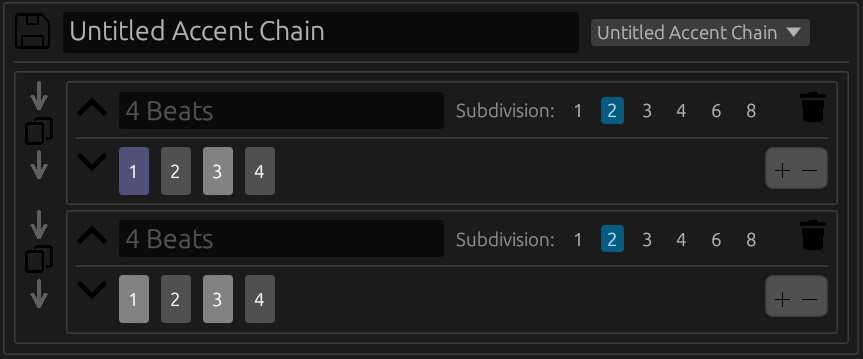
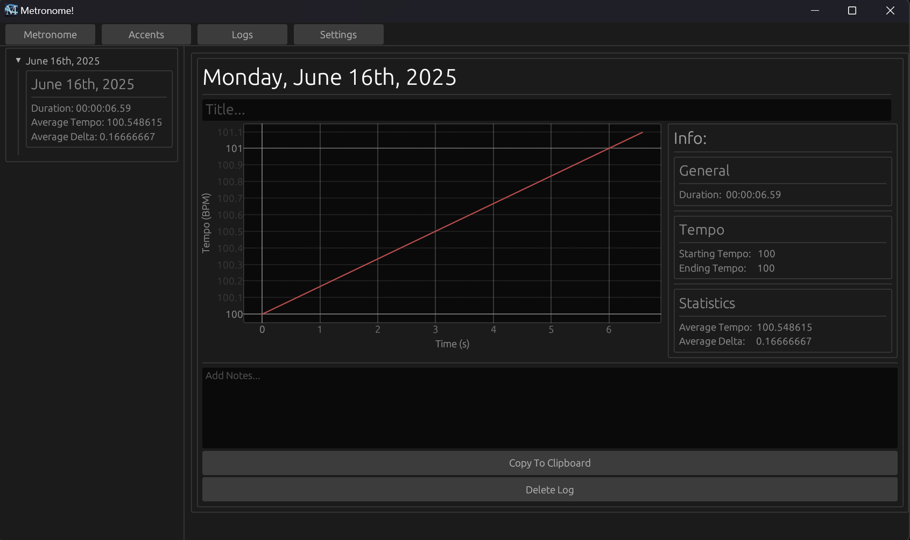

# 🎵 Metronome!

**Metronome!** is a highly customizable metronome app built with flexibility in mind. It supports tempo changes over time, customizable accent patterns with evolving time signatures, and automatic logging of your practice sessions.


---

## 🛠 Features

### 🎚 Tempo Control

The **Tempo** panel lets you set a minimum and maximum tempo. The **Exercise Length** panel controls how long it takes to transition from the minimum to the maximum tempo. If the **Infinite** box is checked, the metronome will continue increasing past the maximum tempo at the same rate.

By default, Metronome! uses a **Linear** growth behavior to interpolate between tempos. You can also choose from **Exponential**, **Sigmoidal**, **Logarithmic**, or **Sine** curves. A visual graph shows the tempo curve based on your selection.

> 💡 To use Metronome! as a traditional metronome, select the **Constant** growth behavior. This disables tempo change and lets you directly set a fixed tempo.

#### 🔊 Sounds

Under the **Sounds** panel, you can choose from 6 sound options: _Beep_, _Thump_, _Tone_, _Clave_, _Cowbell_, and _Drums_. Volume can also be adjusted here.

---

### 🔁 Accents

Access the **Accents** tab from the top-left of the app. This is where you can build and customize rhythmic patterns to practice with.



By default, a chain titled "Untitled Accent Chain" with two bars is created. You can:

- Rename the chain by clicking the title.
- Load a preset using the dropdown to the right.
- Save your own presets by clicking the save icon to the left.

Changes made after saving won't be included unless you save again.

Each **Accent Chain** is composed of bars:

- Duplicate a bar: Click the center duplicate icon.
- Add a new bar: Use the arrows on either side of the duplicate button (left = insert before, right = insert after).
- Delete a bar: Click the trash icon in the top-right of the bar.
- Rename a bar: Type in the title area (optional).
- Reorder bars: Use the up/down arrows near the title.
- Add/remove beats: Click the plus/minus icons below the trash can.

There are four beat types, each with a different color:

- _Downbeat_
- _Strong_
- _Weak_
- _Off_

Hover over a beat to change its type.

The **Subdivision** setting determines how many evenly spaced beats are inserted between each defined beat. A subdivision of 1 means no extra beats are added.

---

### 📝 Logs

Metronome! automatically logs your practice sessions and stores them locally in a `.json` file—no internet connection, telemetry, or data harvesting.



In the **Logs** menu, you can:

- View previous sessions (grouped by date)
- Rename sessions
- Add personal notes

You can disable logging entirely via the **Settings** menu.

---

### ⚙️ Settings

The **Settings** menu lets you:

- Change the app’s color theme
- Enable/disable automatic log saving
- Change log granularity to decrease storage space
- Set minimum practice lengths to qualify for saving

---

## 📦 Installation

### 🪟 Windows Executable

1. Download the latest release from the [Releases page](https://github.com/your-UnbrokenHunter/MetronomeApp/releases)
2. Extract the zip
3. Run the `.exe` (no installation required)
4. Ensure the `assets/` folder is next to the `.exe` to enable sound playback

---

### 🧪 Build from Source

Make sure [Rust](https://www.rust-lang.org/tools/install) is installed.

```bash
git clone https://github.com/your-UnbrokenHunter/MetronomeApp.git
cd MetronomeApp
cargo run --release
```

To build a release .exe:

```bash
cargo build --release
```

Output will be in target/release/MetronomeApp.exe.

### 📄 License

This project is licensed under the MIT License. See the LICENSE file for details.
