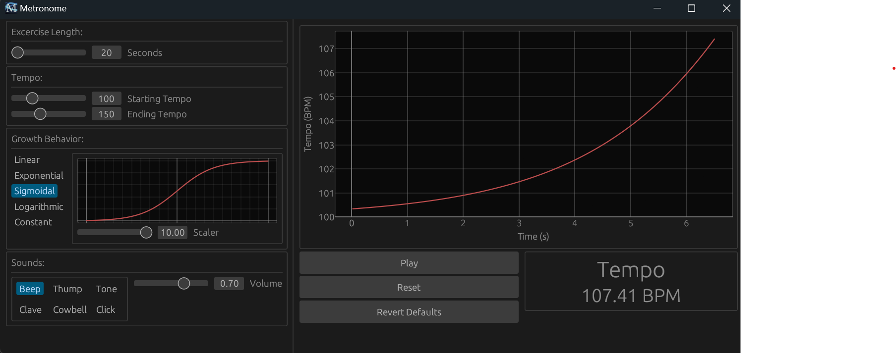

# 🎵 Metronome

A customizable metronome made with change over time in mind, built in Rust using `eframe`/`egui`. Easily adjust tempo behavior, select metronome sounds, visualize progress, and train with dynamic speed curves.



## 🛠 Features

- 📈 Visual tempo curve plot
- 🎚 Adjustable tempo range and curve type
- ⏱ Linear, exponential, logarithmic, sigmoidal, or constant tempo growth
- 🔊 Multiple metronome sound options
- 🎧 Adjustable output volume
- ✅ Responsive real-time UI (no sleep/delay)

## 📦 Installation

### 🪟 Windows Executable

1. Download the latest `.exe` from [Releases](https://github.com/your-UnbrokenHunter/MetronomeApp/releases)
2. Run the executable (no install required)
3. Ensure `assets/` folder is alongside the `.exe` for sound files to work

### 🧪 Build from Source

Make sure [Rust](https://www.rust-lang.org/tools/install) is installed.

```bash
git clone https://github.com/your-UnbrokenHunter/MetronomeApp.git
cd MetronomeApp
cargo run --release
```

To build a release .exe:

```bash
cargo build --release
```

Output will be in target/release/MetronomeApp.exe.

### 📄 License

MIT License. See LICENSE file.
